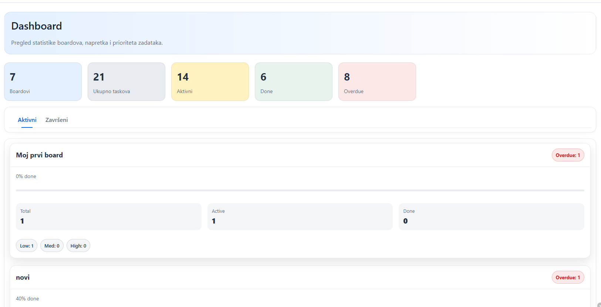
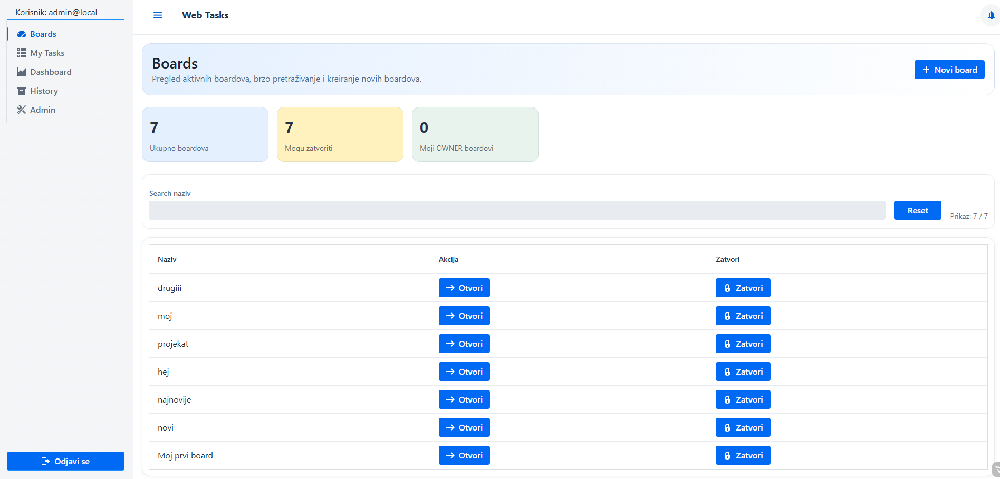
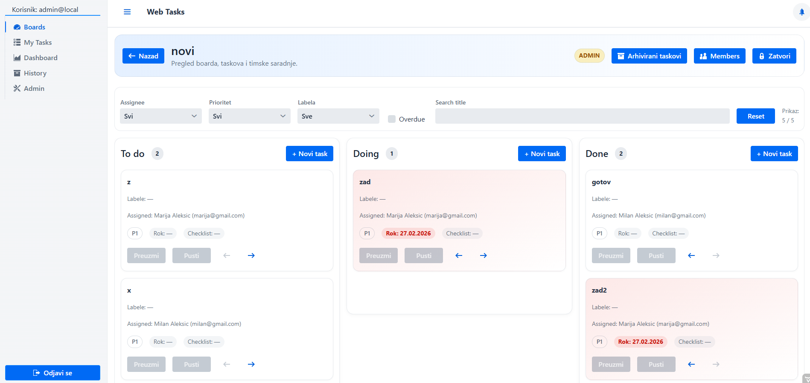
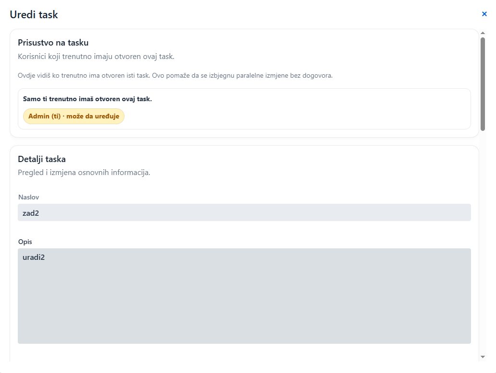
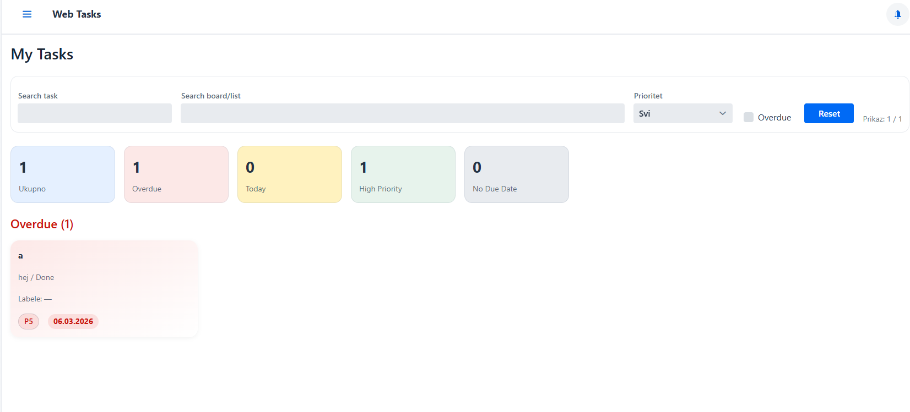
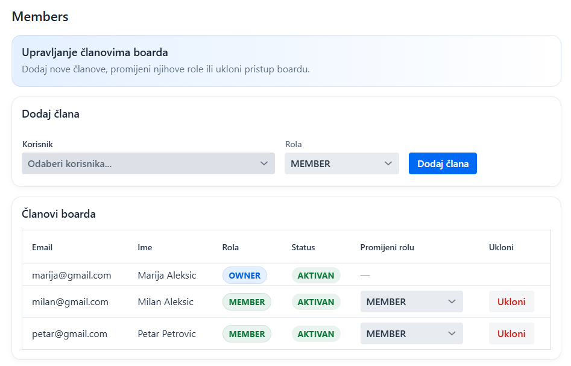
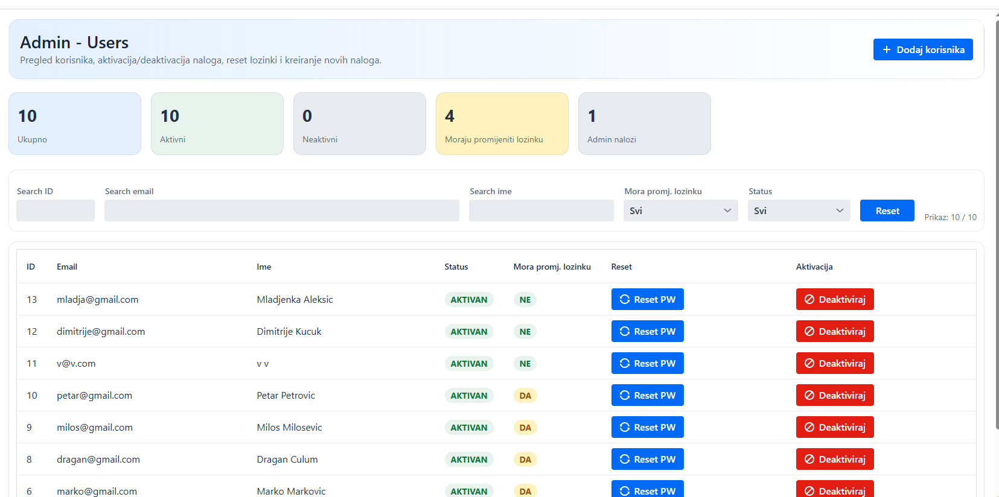

# Web Tasks

A full-stack task management application built with **Java, Spring Boot, Vaadin, Spring Security, and MySQL**.

Web Tasks provides a Kanban-style workspace for organizing boards, lists, and tasks while supporting role-based collaboration, task assignments, comments, attachments, activity tracking, and administrative features.

The application was designed with a focus on **backend business logic, security, database-driven workflows, and role-based access control**.

---

## 🚀 Key Features

- 🔐 User authentication and authorization
- 👥 Role-based access control
- 📋 Board creation and management
- 👤 Board member management
- 📝 Kanban-style lists and task cards
- 🎯 Task assignment to users
- ⚡ Task priorities and due dates
- 🔄 Drag-and-drop task management
- 🔎 Task filtering and search
- 💬 Task comments
- 📎 File attachments
- 📜 Activity tracking and audit history
- 🗄️ Board archiving
- 👨‍💼 Administrative user management
- 🔒 Permission checks for board and task operations

---

## 🛠️ Technology Stack

### Backend

- **Java 21**
- **Spring Boot 3**
- **Spring Security**
- **Spring Data JPA**
- **Hibernate**
- **Maven**

### Frontend

- **Vaadin Flow**
- **HTML / CSS**

### Database

- **MySQL**
- **JPA / Hibernate ORM**

### Development Tools

- **IntelliJ IDEA**
- **MySQL Workbench**
- **Git & GitHub**
- **Maven**

---

## 🏗️ Application Architecture

Web Tasks follows a layered application architecture:

```text
┌─────────────────────────────┐
│       Vaadin UI Layer       │
│     Views / Components      │
└──────────────┬──────────────┘
               │
               ▼
┌─────────────────────────────┐
│        Service Layer        │
│ Business Logic & Security   │
└──────────────┬──────────────┘
               │
               ▼
┌─────────────────────────────┐
│      Repository Layer       │
│      Spring Data JPA        │
└──────────────┬──────────────┘
               │
               ▼
┌─────────────────────────────┐
│        MySQL Database       │
└─────────────────────────────┘


## 📸 Screenshots

### Dashboard

Overview of boards, task statistics, and important project information.



---

### Boards Overview

Overview of available boards and quick access to project workspaces.



---

### Kanban Board

Tasks are organized into lists and managed through a Kanban-style interface.



---

### Task Details

Tasks support detailed descriptions, priorities, assignees, due dates, comments, attachments, and activity tracking.



---

### My Tasks

Personal task overview showing tasks assigned to the currently logged-in user.



---

### Board Members & Roles

Board owners and administrators can manage members and board-level permissions.



---

### Administration

Administrative view for user and system management.


